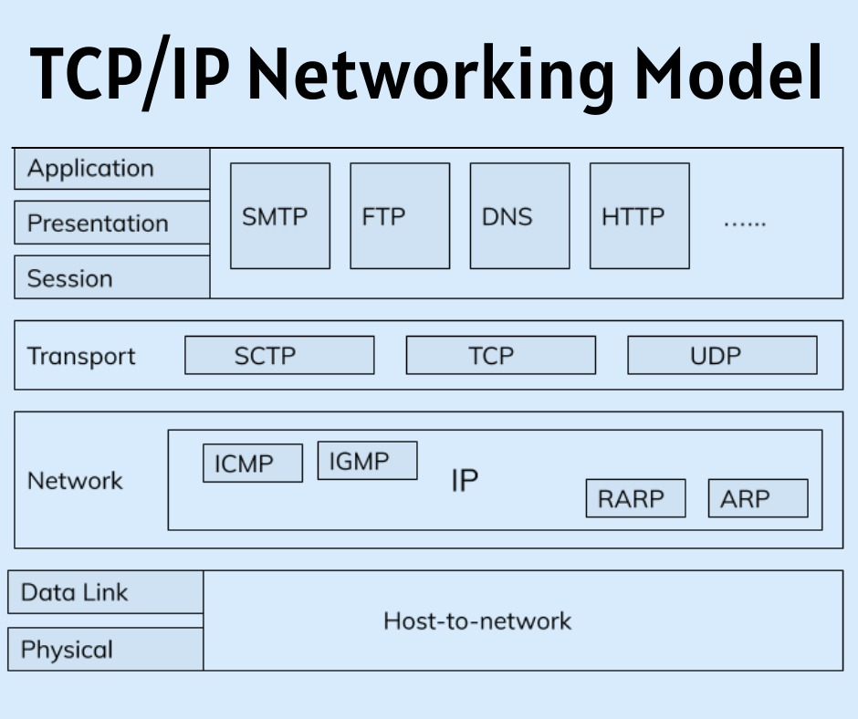

# Session 1: Introduction to web fundamentals

## 1. What is a protocol stack, and how is it used in web development?

The devices on the network communicate with each other. Such as client and server. And to facilitate this communication, a set of protocols or communication protocols are set. These are usually called network stacks or communication stacks.
They are stacked in hierarchical order. Each layer has a particular function and each layer works together to provide a framework for devices to communicate.
For example, There is an OSI model consisting of 7 layers and a TCP/IP (Transmission Control Protocol/Internet Protocol) model which is used on the Internet.

This has 4 layers in the protocol stack.

- ##### Application Layer

  This layer provides an interface between the network applications and other layers of the TCP/IP protocol stack and ultimately the network. while the bottom layers are focused on encapsulating and formatting and transferring data. Common protocols used at this layer are HTTP, DNS, FTP, etc.

- ##### Transport Layer

  This layer defines how data should flow between hosts. It is responsible for the reliability, flow control, and correction of data which is being sent over the network. The two protocols used in the transport layer are the User Datagram Protocol and the Transmission control protocol.

- ##### Internet Layer

  This layer helps in identifying where the devices are located on the internet and the arrival of data packets irrespective of the paths they take. It deals with IP addressing, host-to-host connection etc.

- ##### Link Layer

  It is the lowest level of the model and is also known as the physical layer because it deals with the actual transmission of data on the physical network. It defines how physical data is sent through the network.
  Ethernet is one of the protocols used at this layer.

  In the context of web development, The browser which runs most of the web applications lies within the Application layer. HTTPS/HTTP is used to deliver web pages/images/javascript/videos between servers and clients. Web developers use these protocols for secure and reliable transmission to clients.

  As backend developer, understanding the relevant protocols and their functionalities in the TCP/IP stack is crucial for backend developers to ensure seamless communication between the backend server and clients, and to develop robust, efficient, and secure web applications.

## 2. What are the different types of web servers, and how do they differ in terms of functionality and performance?

A web server hosts files and data to serve other devices on the network. It stores and delivers web content (HTML, Javascript, CSS etc.), handles and generates HTTP requests, manages web applications and can serve multiple clients at the same time.
There are many web servers. Here a few most commonly used :

- ##### Apache HTTP Server
  It is an open source web server and very widely used around the world. Apache supports both static and dynamic websites. It works with Windows, Linux and MacOS. It is known for its high performance, stability, and flexibility. it is a more general-purpose web server that supports a wide range of configurations, including dynamic content generation using server-side scripting languages.
  Apache also provide Tomcat, which is a specialized application server designed for java based applications i.e servlets and JSP
- ##### LIGHTTPD
  lighttpd is designed for low resource consumption and a good performance. It is very lightweight, and open source. It can support both static and dynamic content, but ideally should be used for static content, as they are less resource demanding. They are generally used in embedded systems because of low requirements. They are know for simplicity, speed and reliability.
- ##### Nginx
  Engine-x uses event-driver architecture unlike traditional server which uses thread based design.therefore it can handle a large number of concurrent connections.So it is ideal for high traffic web applications. It is used as load balancer or reverse proxy server for the same reason. It can host both static and dynamic content.
- ##### Microsoft Internet Information Service(IIS)
  Web server developed by microsoft to run on Windows server. It is an ideal choice for organisation who like to work with microsoft product environments such as .NET, Active Directory , and SQL Server.
  It is highly secure and scalable.
- ##### Caddy
  Caddy is open source server with automatic HTTPS configuration and can be used by enterprise.It takes care of TLS certificate renewals, OCSP stapling, static file serving, reverse proxying, Kubernetes ingress, and more.Caddy supports the latest HTTP protocols, including HTTP/2 and HTTP/3, which provide improved performance and security compared to older HTTP protocols.

## 3.What is web hosting, and what are the different types of hosting services available for websites?

Web hosting service allows the publishing of a website or web application on the internet. The idea is to rent some space on a server where all the files and data required for the website are served.
They provide storage, computing power and security.
There are different types of web hosting services available for websites, such as shared hosting, VPS hosting, dedicated hosting, cloud hosting, WordPress hosting, etc
- ##### Shared hosting
    In shared hosting the resources such as computing power, storage and memory are shared by multiple websites.
    It is a very economical option because the server is shared among websites. and therefore it is ideal for small to medium size web apps.
    The hosting provider takes care of server maintenance, security and operation. As a user, you don't have much control over it.
    The major con of shared hosting is that websites hosted on the shared server might face performance issues because of resources consumed by other web applications on the server.
    It is ideal for customers who do not require dedicated resources and technical requirements

- ##### Cloud hosting
    Unlike tradition hosting, website is hosted on a network of connected virtual and physical servers. Therefore it is ideal for scalability and reliability. The resources such as computing, storage and memory are distributed across multiple servers on a cloud.
    This lets traffic spikes handle easily. Cloud hosting is ideal choice for business which requires high availability, and scalability.

- ##### Managed hosting
    In managed hosting, providers of such service lease the dedicated hardware/server to the customers and manages technical aspects of it for the customer.
    The hosting team has a professional team which handles setup, administration, setup and overall support of the server.
    It is an ideal choice for customers who do not have technical expertise to manage server or a dedicated team for it. This allows customers to do best what they do and let reliable service providers take care of servers.
    However, it is generally very costly and vendor depended. Also, customer do not have full control over their server and setup.

- ##### VPS hosting
    It provides you virtual server that mimics a physical server but a single machine is shared between users. so we can assume, it combines features of Shared hosting and Dedicated hosting. Each physical server is partitioned into multiple Virtual private servers.
    Each VPS is independent and has it's own resources allocated to it. Compared to Dedicated hosting, it is economical since you don't need different machines for each user.
    VPS hosting offers more flexibility and scalability compared to shared hosting.
    It is ideal for websites which need more resources than what a shared hosting can offer but at the same time be economical by sharing physical server.

- ##### Dedicated hosting
    A dedicated server is a web hosting service that provides you with a physical server that is exclusively yours. A dedicated server provides exclusive use of all the server's resources, including CPU, RAM, storage, bandwidth, and operating system, to a single user or organization.
    The customer has full control over the server, with root access customers can set up, maintain all aspects of server.
    The performance and response times can be optimized for the specific needs of the customer's applications or websites.
    Applications which need high resources, huge traffic load and high security should consider dedicated hosting.

## 4.What is scaling, and why is it important for web applications? How does scaling differ for vertical and horizontal scaling?
The workload for web application can increase such as more users, requests or data. The ability to meet this demand is called scalability.
The performance, reliability and user experience of a  website is depended on scalability. The application which cannot scale becomes unresponsive or even crash during high traffic.

There are two main ways to scale a web application: vertical scaling and horizontal scaling. 
If you add more computing power or memory to an existing server it is vertical scaling. It can improve the performance of the web application.
There is only a certain limit where you can increase the computing power. and it does not improve availability of web site.Vertical scaling requires downtime for server maintenance so not ideal choice for highly available applications.

Horizontal scaling is when you add more servers to distribute the workload. More servers increase the reliability and availability of the website. 
But then you have to implement load balancing between servers, and data consistency. The ideal choice to make a highly reliable web application.
It can be costly to add a physical server compared to vertical scaling.

## 5. What is SEO (Search Engine Optimization), and how can web developers optimize their websites for better search engine rankings?

Search engines are constantly crawling websites to analyze their content and then rank it when users look for certain keywords.
The practice of optimizing a website so that it ranks well on search engines is called SEO(Search engine optimization).
By using SEO website owners can increase the organic traffic to the website by making the website more relevant and user-friendly.
It involves creating a website that is optimized for search engines from the ground up, taking into account factors such as site structure, content, speed, usability, accessibility, and security.
Web developers can optimize their websites by using various techniques and SEO practices:
- ##### Content
    Users love original, engaging and useful content that aligns with what they searched for. Avoid duplicate content is very important and also avoid content that violates SEO guidelines.
- ##### Backlinks
    When a website has a lot of incoming traffic from trusted websites, the search engine ranking system increases the rank of a website. It is important to have quality backlinks to create credibility. There are many link-building practices such as guest posting, content partnership etc.
- ##### Keywords
    It is important to do proper keyword research and use them in titles, headings, content, URL and alt attributes of images. The keywords used should align with what users are searching for and also what the website is providing. Google Keyword Planner is a highly used tool to plan and analyse trends about a keyword.
- ##### Social Media
	Social media content can help increase the visibility and traffic of a website. These platforms allow to create of credibility, brand presence and engagement. The content of the website can be shared over social media for better reach. 
- ##### Website
	Well, an organized website with a clear structure ranks very highly on search results. developer must create a website while thinking of SEO as part of the process.  Easy-to-navigate websites are easy for web crawlers to index. If the load time is too high, the web crawler might not index the page.
    Also, the website must be responsive by supporting mobile and other devices.
- ##### Monitoring and Analysis
    SEO is a continuous process of monitoring traffic and user feedback and analysing it to improve website ranking. We can use the webmaster tool to understand how is website performing and then implement better SEO techniques. The following tools are widely used in SEO Google Analytics, Google Search Console, Moz Pro, etc.

