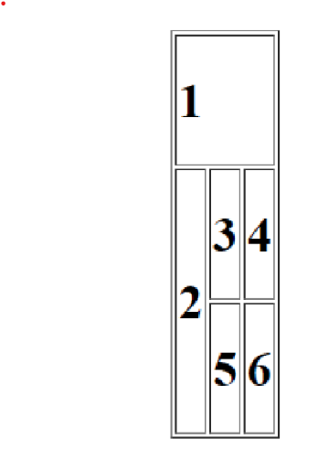
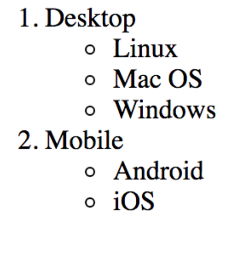

# Tasks
##### 1. Create a table with 3 rows and 3 columns. The top row contains 1 cell that spans 3 columns. The leftmost cell on the next row spans 2 rows. All other cells span a single row and column.
##### Each cell has a number. The numbers can be put in an h1 tag if desired. The image below shows what the table should look like using h1 tags


Here is how we implement it
```
<table>
      <tr>
        <!-- cell which spans over 3 column -->
        <td colspan="3"><h1>1</h1></td>
      </tr>
      <tr>
        <!-- cell which spans over two rows -->
        <td rowspan="2"><h1>2</h1></td>
        <td><h1>3</h1></td>
        <td><h1>4</h1></td>
      </tr>
      <tr>
        <td><h1>5</h1></td>
        <td><h1>6</h1></td>
      </tr>
    </table>
```
CSS to style the table 
```
table {
  border: 1px solid black;
}
td {
  border: 1px solid black;
}

```
##### 2. Recreate the list shown in the image below. The outer list is an order list,and the nested list are unordered.

```
    <!-- Outer list is an ordered list -->
<ol>
      <li>Desktop</li>
      <!-- for sublist we create unordered list -->
      <ul>
        <li>Linux</li>
        <li>Mac OS</li>
        <li>Windows</li>
      </ul>
      <li>Mobile</li>
      <ul>
        <li>Android</li>
        <li>iOS</li>
      </ul>
    </ol>
```