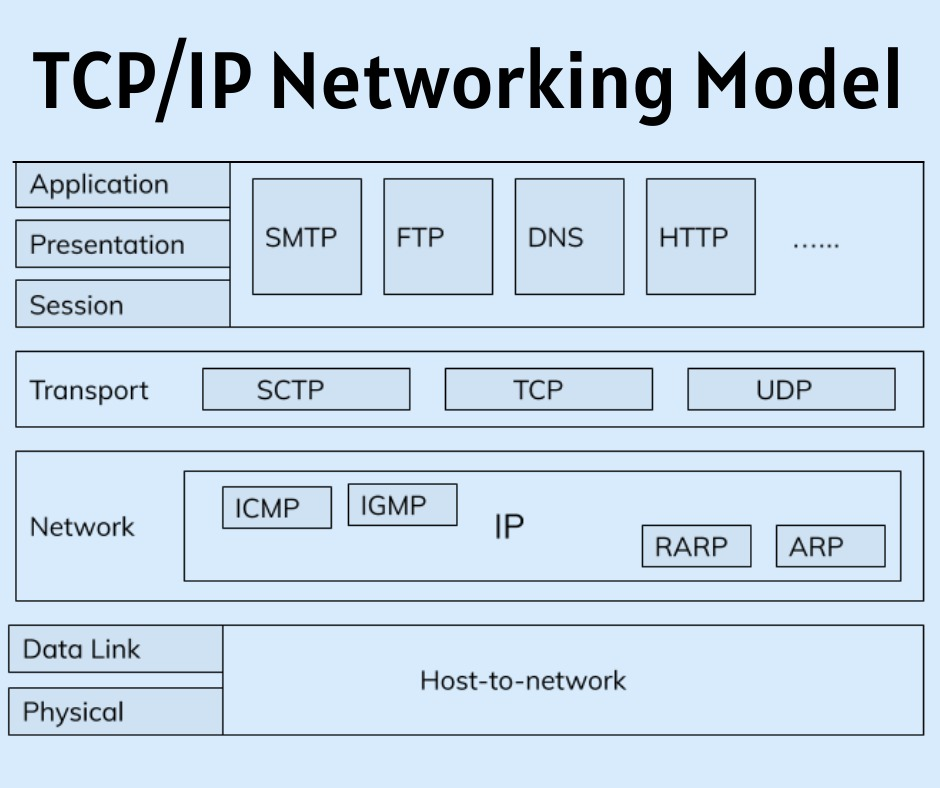

# Session 1: Introduction to web fundamentals

## 1.What is a protocol stack, and how is it used in web development?

The devices on the network communicate with each other. Such as client and server. And to facilitate this communication, a set of protocols or communication protocols are set. These are usually called network stacks or communication stacks.
They are stacked in hierarchical order. Each layer has a particular function and each layer works together to provide a framework for devices to communicate.
For example, There is OSI model consisting of 7 layers and TCP/IP (Transmission Control Protocol/Internet Protocol) model which is used in internet.

This has 4 layers in the protocol stack.

- ##### Application Layer

  This layer provides an interface between the network applications and other layers of TCP/IP protocol stack and ultimately the network. while the bottom layers are focused on encapsulating and formatting an transferring of data. Common protocols used at this layer are HTTP, DNS, FTP, etc.

- ##### Transport Layer

  This layer defines how data should flow between hosts. It is responsible for the reliability, flow control, and correction of data which is being sent over the network.The two protocols used in the transport layer are User Datagram protocol and Transmission control protocol.

- ##### Internet Layer

  This layer helps in identifying where the devices are located on internet and arrival of data packets irrespective of paths they take. It deals with IP addressing, host to host connection etc.

- ##### Link Layer

  It is the lowest level of the model and also knows as physical layer because it deals with actual transmission of data on physical network. It defines how physically data is sent through network.
  Ethernet is once of the protocols used at this layer.

  In context of web development, The browser which runs most of the web application lies within Application layer. HTTPS/HTTP is used to deliver web pages/images/javascript/videos between server and clients. Web developers use these protocols for secure and reliable transmission to clients.

  As a backend developer, understanding the relevant protocols and their functionalities in the TCP/IP stack is crucial for backend developers to ensure seamless communication between the backend server and clients, and to develop robust, efficient, and secure web applications.

## 2.What are the different types of web servers, and how do they differ in terms of functionality and performance?
A webserver hosts files and data to serve other devices on network. It stores and delivers web content (HTML, Javascript, CSS etc.), handles and generates HTTP requests, manages web applications and can serve multiple clients at the same time.
There are many webservers. Here are a few most commonly used :
- ##### Apache HTTP Server
    It is an open source web server and very widely used around the world. Apache supports both static and dynamic websites. It works with Windows, Linux and MacOS. It is known for its high performance, stability, and flexibility.  it is a more general-purpose web server that supports a wide range of configurations, including dynamic content generation using server-side scripting languages.
    Apache also provide Tomcat, which is a specialized application server designed for java based applications i.e servlets and JSP
- ##### LIGHTTPD
    lighttpd is designed for low resource consumption and a good performance. It is very light weight, and open source. It can support both static and dynamic content, but ideally should be used for static content, as they are less resource demanding. They are generally used in embedded systems because of low requirements. They are know for simplicity, speed and reliability.
- ##### Nginx
    Engine-x uses event-driver architecture unlike traditional server which uses thread based design.therefore it can handle a large number of concurrent connections.So it is ideal for high traffic web applications. It is used as load balancer or reverse proxy server for the same reason. It can host both static and dynamic content.
- ##### Microsoft Internet Information Service(IIS)
    Web server developed by microsoft to run on windows server. It is an ideal choice for organization who like to work with microsoft product environments such as .NET, Active Directory , and SQL Server.
    It is highly secure and scalable.
- ##### Caddy
    Caddy is open source server with automatic HTTPS configuration and can be used by enterprise.It takes care of TLS certificate renewals, OCSP stapling, static file serving, reverse proxying, Kubernetes ingress, and more.Caddy supports the latest HTTP protocols, including HTTP/2 and HTTP/3, which provide improved performance and security compared to older HTTP protocols.

    
## 3.What is web hosting, and what are the different types of hosting services available for websites?

    
## 4.What is scaling, and why is it important for web applications? How does scaling differ for vertical and horizontal scaling?

## 5.What is SEO (Search Engine Optimization), and how can web developers optimize their websites for better search engine rankings?
